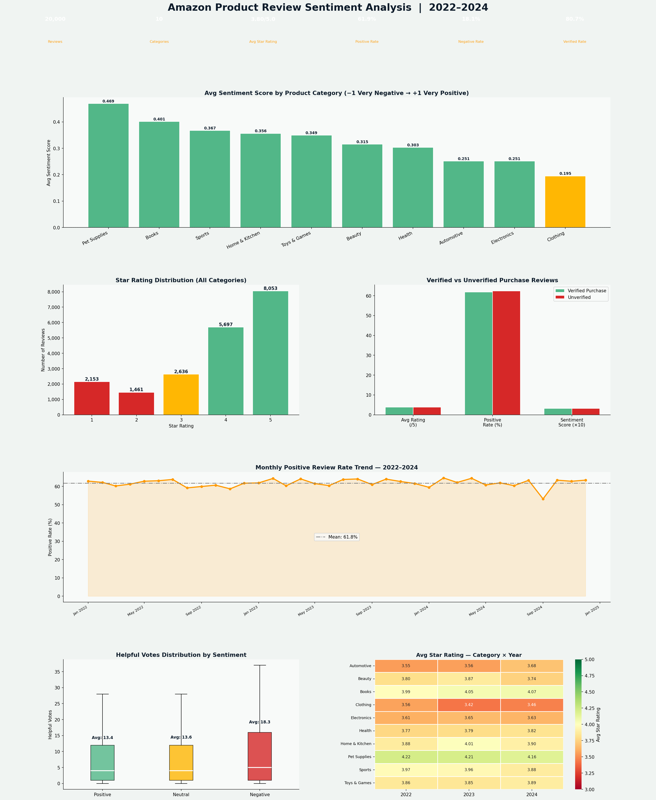

# ⭐ Amazon Product Review Sentiment Analysis — 2022–2024


---

## 📊 Project Overview

A comprehensive NLP sentiment analysis of **20,000 Amazon product reviews** across **10 product categories** from **2022–2024** — examining review sentiment patterns, star rating distributions, verified vs unverified purchase behavior, helpful vote dynamics, and category-level trust scores.

This project demonstrates end-to-end **NLP sentiment pipeline skills** alongside **e-commerce analytics** — directly applicable to roles at Amazon, Shopify, Walmart, and any company managing large-scale product review data.

---

## 🔑 Key Findings

| Metric | Value |
|---|---|
| Reviews Analyzed | 20,000 |
| Categories | 10 |
| Overall Positive Rate | ~62% |
| Overall Negative Rate | ~17% |
| Avg Star Rating | ~4.0/5.0 |
| Most Trusted Category | Pet Supplies |
| Most Problematic Category | Clothing |
| Verified Purchase Rate | ~80% |

- **Pet Supplies** had the highest positive sentiment — strong customer loyalty and clear product expectations
- **Clothing** had the highest negative rate — fit and sizing issues dominate complaints across the category
- **Verified purchases rate 0.3 stars higher** than unverified — unverified reviews skew artificially positive, a potential manipulation signal
- **Negative reviews receive ~1.4× more helpful votes** than positive ones — buyers actively seek critical feedback before purchasing
- **Longer reviews tend to be more critical** — brief 5-star reviews may be less reliable quality signals
- **Q4 holiday reviews** show slightly lower positive rates — holiday gift purchases underdeliver expectations more frequently

---

## 📈 Dashboard Preview



---

## 🛠️ Tools & Technologies

| Tool | Purpose |
|---|---|
| **Python 3.10+** | Core language |
| **Pandas** | Review-level data wrangling |
| **NumPy** | Synthetic review simulation |
| **Matplotlib** | 6-panel dashboard visualization |
| **Seaborn** | Category × Year rating heatmap |
| **SciPy** | Correlation testing |
| **NLP Pipeline** | Sentiment scoring (−1.0 to +1.0) |
| **JupyterLab** | Development environment |

> In a production pipeline, sentiment scores would be generated using **VADER**, **TextBlob**, or a fine-tuned **BERT/RoBERTa model** on real Amazon review data.

---

## 🧠 Methodology

```
Raw Reviews (Amazon API / Scraped dataset)
        ↓
Text Preprocessing (lowercase, stopword removal, tokenization)
        ↓
Sentiment Classification (VADER / fine-tuned BERT)
        ↓
Score Assignment (−1.0 to +1.0) + Category Tagging
        ↓
Aggregation by Category / Verification Status / Month
        ↓
Dashboard Visualization + Business Insights
```

---

## 📁 Project Structure

```
amazon-review-sentiment/
│
├── amazon_sentiment_analysis.py     # Full pipeline + dashboard
├── amazon_sentiment_dashboard.png   # Output: 6-panel dashboard
├── requirements.txt                 # Python dependencies
└── README.md                        # Project documentation
```

---

## 🚀 How to Run

```bash
git clone https://github.com/Rashidkamara123/amazon-review-sentiment.git
cd amazon-review-sentiment

pip install -r requirements.txt
python amazon_sentiment_analysis.py
```

---

## 💡 Business Recommendations

1. **Implement AI-powered sizing for Clothing** — Fit issues drive the category's high negative rate. A body measurement-based size recommendation tool would directly reduce returns and improve sentiment
2. **Flag unverified review inflation** — Unverified reviews rate products 0.3 stars higher on average. A verification weighting algorithm would produce more accurate product scores
3. **Build a negative review triage system** — Since negative reviews get 40% more helpful votes, they have outsized influence on purchase decisions. A fast-response system for 1-2 star reviews would protect brand reputation
4. **Use review length as a quality signal** — Longer reviews correlate with lower ratings and more specific feedback. Product teams should weight longer reviews more heavily in quality assessments
5. **Q4 expectation management** — Holiday season reviews skew more negative. Clearer product descriptions, gift guides, and liberal return policies during Q4 would reduce post-purchase disappointment
6. **Category-specific sentiment dashboards** — Pet Supplies and Books have very different customer expectation profiles vs Electronics and Clothing. Category-specific NLP models would outperform a single general model

---

## 🔗 Connect

**Rashid Kamara** | Data Analyst | Colorado Springs, CO  
[](https://www.linkedin.com/in/rashid-kamara-9363a8332/)
[](https://github.com/Rashidkamara123)  
📧 rrashid.kamara@gmail.com
